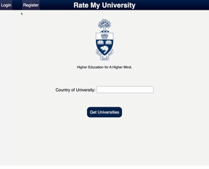

# Rate My Uni 

'Rate My Uni' is based on the idea of popular platform 'Rate My Prof'. This site allows students to submit ratings for specific courses in their university and view what other people have said about these courses. 

Hosted at: https://dry-cliffs-90706.herokuapp.com/

Technology Stack: 
 - NodeJS (https://nodejs.org/en/)
 - Express framework (https://expressjs.com/)
 - MongoDB (hosted on https://mlab.com/)
 - Javascript + bootstrap styling

   